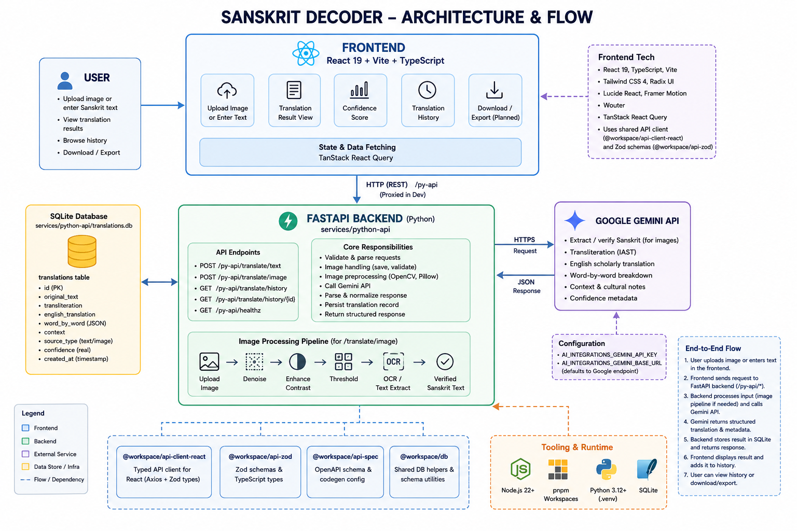

# Sanskrit Decoder

Sanskrit Decoder is a full-stack Sanskrit translation project. It lets users translate typed Sanskrit or Devanagari text, upload manuscript and inscription images, view scholarly translation details, and browse translation history.

## Technology

- **Frontend:** React 19, TypeScript, Vite, Tailwind CSS 4, Radix UI, Lucide React, Framer Motion, Wouter, TanStack React Query
- **Python API:** FastAPI, Uvicorn, Aiosqlite, Pillow, NumPy, OpenCV headless, HTTPX
- **AI integration:** Google Gemini API for Sanskrit and image-based translation
- **Database:** SQLite (`services/python-api/translations.db`)
- **Workspace tooling:** pnpm workspaces for JavaScript/TypeScript packages, Python `.venv` for backend dependencies

## Quick Reference - Get Started in 5 Minutes

If you just want to run the project quickly after setup:

```powershell
# Terminal 1: Start Backend
.\.venv\Scripts\Activate.ps1
python services\python-api\main.py

# Terminal 2: Start Frontend
cd artifacts\sanskrit-translator
pnpm dev

# Then open: http://localhost:5173
```

For detailed setup instructions, see [Setup & Installation](#setup--installation) section below.

## Project Structure

- `artifacts/sanskrit-translator` - React/Vite frontend application
- `services/python-api` - FastAPI backend API used by the frontend
- `lib/api-client-react` - shared React API client library
- `lib/api-zod` - shared Zod schema and API types
- `lib/api-spec` - OpenAPI schema and generation config
- `lib/db` - shared database/schema helpers
- `artifacts/api-server` - alternative Express API workspace package
- `scripts` - workspace utility scripts

## Requirements

### Before you start

Make sure you have the following installed on your system:

- **Node.js 22+** — [Download from nodejs.org](https://nodejs.org/)
  - Verify installation: `node --version`
  - pnpm comes with Node.js via Corepack
  
- **Python 3.10+** — [Download from python.org](https://www.python.org/downloads/)
  - Verify installation: `python --version`
  - Make sure `pip` is available: `pip --version`
  
- **Git** — [Download from git-scm.com](https://git-scm.com/)
  - Verify installation: `git --version`
  
- **Google Gemini API Key** — [Get it from Google AI Studio](https://aistudio.google.com/app/apikey)
  - You'll need this to enable Sanskrit translation features

### Optional tools

- **VS Code** — Recommended code editor for development
- **Docker & Docker Compose** — Only if you want to run the project in containers

## Backend details

The backend lives in `services/python-api` and provides the following:

- `GET /py-api/healthz` - health check
- `POST /py-api/translate/text` - translate typed Sanskrit text
- `POST /py-api/translate/image` - translate an uploaded image file
- `GET /py-api/translate/history` - list recent translations
- `GET /py-api/translate/history/{id}` - fetch a saved translation record

The backend uses SQLite at:

- `services/python-api/translations.db`

The database stores translation records with fields such as:

- `original_text`
- `transliteration`
- `english_translation`
- `word_by_word`
- `context`
- `source_type`
- `confidence`
- `created_at`

## Frontend details

The frontend lives in `artifacts/sanskrit-translator`.

It renders:

- upload form for images and Sanskrit text
- translation result details
- confidence score and history
- download/export options for translated results

The frontend expects the backend API at `http://127.0.0.1:8000` by default. Requests are proxied through `/py-api`.

## Setup & Installation

Follow these steps to get the project running on your local machine after cloning from GitHub.

### Step 1: Clone the Repository

```powershell
git clone https://github.com/your-username/Sanskrit-Decoder.git
cd Sanskrit-Decoder
```

**What this does:** Downloads the entire project code to your computer and navigates into the project folder.

### Step 2: Verify Prerequisites

Check that all required tools are installed:

```powershell
# Check Node.js version (should be 22+)
node --version

# Check npm/pnpm availability
npm --version

# Check Python version (should be 3.10+)
python --version

# Verify pip is available
pip --version
```

If any of these show errors or outdated versions, install the latest versions from the links above.

### Step 3: Install Node.js Dependencies

```powershell
pnpm install
```

**What this does:** 
- Installs all JavaScript/TypeScript packages for the entire workspace
- Creates a `node_modules` folder with all dependencies
- Sets up shared libraries for both frontend and backend communication
- This may take 1-2 minutes depending on your internet speed

**Expected output:** You should see "Done in X.Xs" when complete.

### Step 4: Create Python Virtual Environment

```powershell
python -m venv .venv
```

**What this does:**
- Creates an isolated Python environment in the `.venv` folder
- Ensures project dependencies don't interfere with your system Python
- This takes a few seconds and creates about 200MB in your project folder

### Step 5: Activate Python Virtual Environment

```powershell
# On Windows (PowerShell):
.\.venv\Scripts\Activate.ps1

# On Windows (Command Prompt):
.\.venv\Scripts\activate.bat

# On macOS/Linux:
source .venv/bin/activate
```

**What this does:**
- Activates the isolated Python environment
- Your terminal prompt should now show `(.venv)` at the beginning
- All subsequent `pip install` commands will use this virtual environment

**Note:** You must activate the virtual environment every time you open a new terminal.

### Step 6: Install Python Dependencies

```powershell
pip install -e .
```

**What this does:**
- Installs all Python packages listed in `pyproject.toml`
- Installs FastAPI, Uvicorn, Google Generative AI, image processing libraries, and database tools
- The `-e` flag installs the project in "editable" mode for development
- This may take 3-5 minutes as it downloads and compiles dependencies

**Expected output:** You should see "Successfully installed" message with a list of packages.

### Step 7: Create Environment Configuration File

Create a `.env` file in the repository root with your Gemini API credentials:

```powershell
# Create the file (on Windows)
New-Item -Path .\.env -ItemType File

# Or use your text editor to create: Sanskrit-Decoder/.env
```

Add the following content to the `.env` file:

```text
AI_INTEGRATIONS_GEMINI_API_KEY=your-actual-api-key-here
AI_INTEGRATIONS_GEMINI_BASE_URL=https://generativelanguage.googleapis.com/v1beta
```

**What this does:**
- Stores your Gemini API key securely
- Enables the Sanskrit translation feature
- Without this, the app will work but translation requests will fail

**Getting your API key:**
1. Go to [Google AI Studio](https://aistudio.google.com/app/apikey)
2. Sign in with your Google account
3. Click "Create API key"
4. Copy the key and paste it into the `.env` file
5. Save the file

**Important:** Do NOT commit `.env` to GitHub. It's already in `.gitignore`.

## Running the Project

After completing the setup steps above, follow these instructions to start both the backend and frontend servers.

### Quick Start (Recommended for most users)

Open **two separate terminals** in the project root and run:

**Terminal 1 - Backend Server:**

```powershell
# Activate Python environment
.\.venv\Scripts\Activate.ps1

# Run the backend
python services\python-api\main.py
```

You should see:
```
INFO:     Started server process [XXXX]
INFO:     Uvicorn running on http://0.0.0.0:8000
```

**Terminal 2 - Frontend Server:**

```powershell
# Navigate to the frontend folder
cd artifacts\sanskrit-translator

# Start the development server
pnpm dev
```

You should see:
```
VITE v7.3.3  ready in XXX ms

➜  Local:   http://localhost:5173/
```

### Step 1: Start the Backend API Server

The backend provides the translation endpoints that the frontend communicates with.

**Option A: From project root (Recommended)**

```powershell
# Make sure your Python environment is activated (you should see (.venv) in the prompt)
.\.venv\Scripts\Activate.ps1

# Run the backend
python services\python-api\main.py
```

**Option B: Using uvicorn directly**

```powershell
.\.venv\Scripts\Activate.ps1
uvicorn services.python-api.main:app --reload --host 127.0.0.1 --port 8000
```

**What this does:**
- Starts the FastAPI server on port 8000
- Initializes the SQLite database for storing translations
- Enables auto-reload when you modify the code
- Waits for requests from the frontend

**Verify backend is running:**
- Open your browser and go to `http://127.0.0.1:8000/docs`
- You should see the Swagger API documentation
- This confirms the backend is working correctly

**Backend endpoints available:**
- `GET http://127.0.0.1:8000/healthz` - Health check
- `POST http://127.0.0.1:8000/py-api/translate/text` - Translate text
- `POST http://127.0.0.1:8000/py-api/translate/image` - Translate image
- `GET http://127.0.0.1:8000/py-api/translate/history` - View translation history

### Step 2: Start the Frontend Development Server

In a **new terminal window**, navigate to the frontend folder and start the Vite dev server.

```powershell
cd artifacts\sanskrit-translator
pnpm dev
```

**What this does:**
- Starts the Vite development server on port 5173
- Enables hot module reloading (changes appear instantly)
- Sets up a proxy to forward API requests to the backend
- Watches for file changes and auto-compiles

**Frontend access:**
- Open your browser and go to `http://localhost:5173`
- You should see the Sanskrit Decoder UI

**If port 5173 is already in use:**

```powershell
# Use a different port
pnpm dev -- --port 5174
```

### Step 3: Access the Application

1. **Frontend:** Open `http://localhost:5173` in your web browser
2. **Backend API Docs:** Open `http://localhost:8000/docs` to see all available endpoints
3. **Backend Health:** Check `http://localhost:8000/healthz` (should return 200 OK)

### Step 4: Test the Application

Once both servers are running, you can test the features:

1. **Text Translation:**
   - Go to the frontend at `http://localhost:5173`
   - Enter Sanskrit text or paste Devanagari script
   - Click "Translate"
   - View the results including transliteration, English translation, and word-by-word breakdown

2. **Image Translation:**
   - Click the "Upload Image" tab
   - Select a Sanskrit manuscript or inscription image
   - Click "Translate"
   - The backend will process the image and return the translation

3. **Translation History:**
   - All translations are automatically saved to the SQLite database
   - View your translation history in the "History" section

### Stopping the Servers

To stop either server:
- Press `Ctrl+C` in the terminal where it's running
- The server will shut down gracefully

**To restart:** Simply run the same command again in the terminal.

## Common Commands

During development, you'll frequently use these commands:

```powershell
# Frontend commands
cd artifacts\sanskrit-translator
pnpm dev              # Start dev server
pnpm build            # Build for production
pnpm typecheck        # Check TypeScript types

# Backend commands
# (Make sure .venv is activated first)
python services\python-api\main.py    # Run backend
pip install -e .                      # Install dependencies

# Workspace commands
pnpm run typecheck                    # Type-check all packages
pnpm run build                        # Build all packages
pnpm install                          # Install all dependencies
```

## Troubleshooting

### Setup Issues

**Problem: `command not found: node` or `command not found: python`**
- **Solution:** Node.js or Python is not installed or not in your system PATH
- Install from [nodejs.org](https://nodejs.org/) and [python.org](https://www.python.org/)
- Restart your terminal after installation

**Problem: `pnpm: command not found`**
- **Solution:** pnpm is not installed or activated
- Try: `npm install -g pnpm` (requires npm to be installed)
- Or use: `corepack enable` to use pnpm from Node.js

**Problem: `pip install -e .` fails with dependency errors**
- **Solution:** Python version might be incompatible
- Check Python version: `python --version` (should be 3.10+)
- Try upgrading pip: `python -m pip install --upgrade pip`
- Delete `.venv` and recreate it: `rmdir .\.venv` then `python -m venv .venv`

**Problem: `.venv\Scripts\Activate.ps1` fails on PowerShell**
- **Error:** "cannot be loaded because running scripts is disabled"
- **Solution:** Run PowerShell as Administrator, then:
  ```powershell
  Set-ExecutionPolicy -ExecutionPolicy RemoteSigned -Scope CurrentUser
  ```
- Then try activating again

**Problem: `ModuleNotFoundError: No module named 'fastapi'`**
- **Solution:** Python virtual environment is not activated
- Run: `.\.venv\Scripts\Activate.ps1`
- You should see `(.venv)` at the start of your terminal prompt
- Then run the backend again

### Running the Project

**Problem: Backend won't start - `Address already in use`**
- **Error:** `Address already in use (:8000)`
- **Solution:** Port 8000 is already being used
- Find what's using it: `netstat -ano | findstr :8000` (Windows)
- Kill the process or use a different port:
  ```powershell
  uvicorn services.python-api.main:app --port 8001
  ```

**Problem: Frontend won't start - Port 5173 in use**
- **Error:** `EADDRINUSE: address already in use :::5173`
- **Solution:** Use a different port:
  ```powershell
  cd artifacts\sanskrit-translator
  pnpm dev -- --port 5174
  ```

**Problem: Frontend shows `Cannot POST /py-api/translate/text`**
- **Issue:** Backend server is not running or frontend can't reach it
- **Solutions:**
  1. Check backend is running: Open `http://127.0.0.1:8000/docs` in browser
  2. If backend is on a different machine, set: `PY_API_URL` environment variable
  3. Check vite.config.ts proxy configuration points to correct backend URL

**Problem: `403 Forbidden` or Gemini API errors in translation requests**
- **Issue:** Gemini API key is missing or invalid
- **Solutions:**
  1. Verify `.env` file exists in project root
  2. Check the API key is correct: `cat .env` (don't share it!)
  3. Regenerate key from [Google AI Studio](https://aistudio.google.com/app/apikey)
  4. Update `.env` with new key
  5. Restart backend: `Ctrl+C` then run backend command again

**Problem: Frontend not updating when you edit files**
- **Issue:** Hot Module Reloading (HMR) isn't working
- **Solutions:**
  1. Check Vite is running in the correct folder: `artifacts\sanskrit-translator`
  2. Restart Vite: `Ctrl+C` then `pnpm dev`
  3. Clear browser cache: `Ctrl+Shift+Delete`
  4. Hard refresh browser: `Ctrl+Shift+R`

**Problem: SQLite database file not found**
- **Issue:** `FileNotFoundError: services/python-api/translations.db`
- **Solution:** The database is created automatically on first run
- If it's missing, check file permissions and that backend can write to the folder
- Restart the backend: it will initialize the database

### General Debugging

**Check if services are running:**

```powershell
# Check if backend is running (should return 200)
curl http://127.0.0.1:8000/healthz

# Or in PowerShell:
Invoke-WebRequest -Uri http://127.0.0.1:8000/healthz
```

**View backend logs:**
- All backend activity is printed to the terminal where you ran it
- Look for error messages or warnings
- Increase logging by editing `services/python-api/main.py`

**View frontend console errors:**
- Open browser Developer Tools: `F12` or `Ctrl+Shift+I`
- Check the "Console" tab for JavaScript errors
- Check "Network" tab to see API requests and responses

**Reset everything and start fresh:**

```powershell
# Stop both servers (Ctrl+C in their terminals)

# Remove dependencies
rmdir -Recurse node_modules
rmdir -Recurse .venv
rm pnpm-lock.yaml

# Reinstall everything
pnpm install
python -m venv .venv
.\.venv\Scripts\Activate.ps1
pip install -e .

# Start fresh
# Terminal 1:
python services\python-api\main.py

# Terminal 2:
cd artifacts\sanskrit-translator
pnpm dev
```

## Notes

- The app saves translations to SQLite at `services/python-api/translations.db`.
- The backend automatically initializes the database schema on startup.
- The frontend currently uses the Gemini translation API to generate Sanskrit transliteration, translation, and quality/confidence metadata.

## What this project does

Sanskrit Decoder provides an end-to-end workflow for converting Sanskrit or Devanagari script (typed or image) into:

- Verified Devanagari/Sanskrit text
- IAST transliteration
- Fluent scholarly English translation
- Word-by-word breakdown
- Contextual cultural and historical notes
- Confidence metadata for each translation

Users can upload inscription images or paste text, view results in a readable scholarly format, and browse saved translation history.

## Architecture & Flow

1. Frontend (`artifacts/sanskrit-translator`) — React + Vite UI
	- Users upload an image or enter Devanagari/Sanskrit text and submit a translation request.
	- Shows progress state, renders `originalText`, `transliteration`, `englishTranslation`, `wordByWord`, and `confidence`.
	- Offers history browsing and download/export (frontend UI for download is planned as an enhancement).

2. API Backend (`services/python-api`) — FastAPI
	- Routes:
	  - `POST /py-api/translate/text` — accepts text payloads
	  - `POST /py-api/translate/image` — accepts multipart image uploads
	  - `GET /py-api/translate/history` — lists saved translations
	- Image processing pipeline: image resizing, denoising/sharpening (OpenCV/PIL fallback)
	- Calls Google Gemini (Generative Language) API with a scholarly system prompt
	- Parses Gemini JSON output, saves a record to SQLite, and returns the structured result to the frontend

3. Storage — SQLite
	- Located at `services/python-api/translations.db`
	- Stores original text, transliteration, English translation, word-by-word breakdown, context, source type, confidence, and timestamp.

4. External service — Google Gemini
	- Used for OCR-like image-to-text decoding, transliteration, and scholarly translation generation.

Flow summary:

Frontend -> Backend (/py-api) -> Image enhancement -> Gemini API -> Parse JSON -> Save to SQLite -> Respond -> Frontend displays result

## Future enhancements

- Add a `qualityScore` field returned by the backend (e.g., model-estimated translation quality) and display it in the UI.
- Add automatic script-type detection (Devanagari, Brahmi, Grantha, etc.) and present `scriptType` with the translation.
- Add a frontend `Download translation` button that exports JSON, TXT, or PDF for a selected result.
- Add OCR fallback using an OCR engine (Tesseract or a specialized OCR model) for low-quality images before or alongside Gemini.
- Add user accounts and per-user history with optional export & import features.
- Improve reliability with retries, rate-limiting, and caching for Gemini requests.
- Add e2e tests and CI/CD pipeline for automated builds and linting.
- Provide an offline mode with local model support or OCR-only translations.

---
## Scoring details (confidence and quality)

- **Confidence**: this value is taken from the Gemini model output when the model provides an explicit `confidence` field (a float between 0.0 and 1.0). If Gemini does not provide a confidence value, the backend uses a conservative default of `0.8`. This field represents the model's internal estimate of how certain it is about the translation result.

- **qualityScore**: a derived heuristic (0.0–1.0) computed by the backend to give a quick sense of translation completeness and apparent quality. The algorithm is intentionally conservative and currently uses the following rules:
	- Start from the `confidence` (model-provided or default) and scale it slightly (weighted base).
	- Add small bonuses when helpful artifacts are present:
		- `wordByWord` present: +0.05
		- `context` present: +0.03
		- non-empty `transliteration` of reasonable length: +0.02
		- substantive English translation (length heuristic): +0.02
	- The computed score is clamped to the [0.0, 1.0] range and rounded to three decimal places.

The `qualityScore` is intended to be a lightweight, explainable indicator of result quality for UI display and filtering; it is not a replacement for human review. Future improvements can replace or augment this heuristic with model-based calibration or external validation checks.

## Architecture Diagram

The following ASCII diagram shows the high-level runtime flow and is safe to render on GitHub:



This diagram shows the high-level runtime flow: user input in the frontend is sent to the FastAPI backend, images are enhanced, the enhanced payload is sent to Google Gemini, the returned JSON is parsed and persisted, then the frontend displays the structured result.

## Machine learning models and tooling used

- Primary LLM: **Google Gemini** (`gemini-2.5-flash`) — used to perform image-to-text decoding (when given an image payload), IAST transliteration, scholarly English translation, word-by-word breakdown, contextual notes, and an estimated `confidence` value. The backend posts structured prompts (see `TRANSLATION_SYSTEM`, `TRANSLATION_PROMPT_IMAGE`, `TRANSLATION_PROMPT_TEXT`) and expects JSON-only responses.
- Image processing: **OpenCV** (`cv2`) for denoising, adaptive threshold, and sharpening when available. A **PIL** fallback (ImageEnhance, ImageFilter) is used when OpenCV is not present.
- Optional OCR fallback (not currently enabled by default): **Tesseract OCR** or a specialized OCR model can be integrated to extract characters from low-quality images before or alongside Gemini calls.
- Local ML / offline options: none included by default — the system relies on Gemini as the model provider. Future work could add on-device or private model adapters (e.g., OpenVINO, ONNX runtime, or community OCR/transliteration models) for offline support and lower latency.

Notes:

- The `confidence` field comes from the parsed Gemini JSON if provided; otherwise the backend uses a conservative default (0.8) or a parse-time fallback.
- Prompt engineering in `services/python-api/main.py` frames the LLM as an expert Sanskrit scholar and instructs it to return strict JSON to simplify parsing.
- Sending images to Gemini uses base64-encoded inline parts; ensure your API quota and model permissions allow image inputs.
- Keep `AI_INTEGRATIONS_GEMINI_API_KEY` secure and do not commit it — `.env` is ignored by default.
